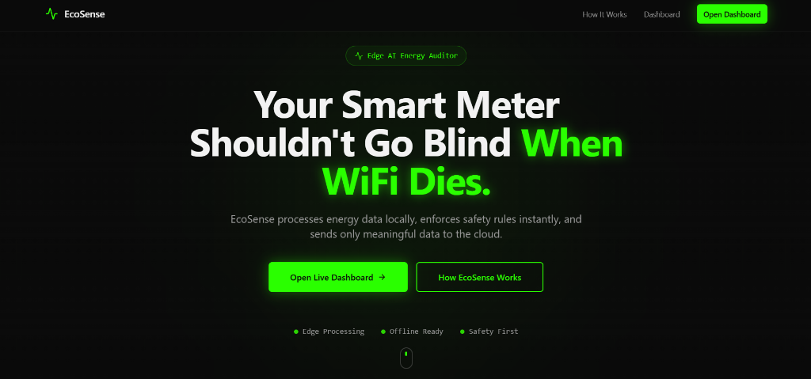
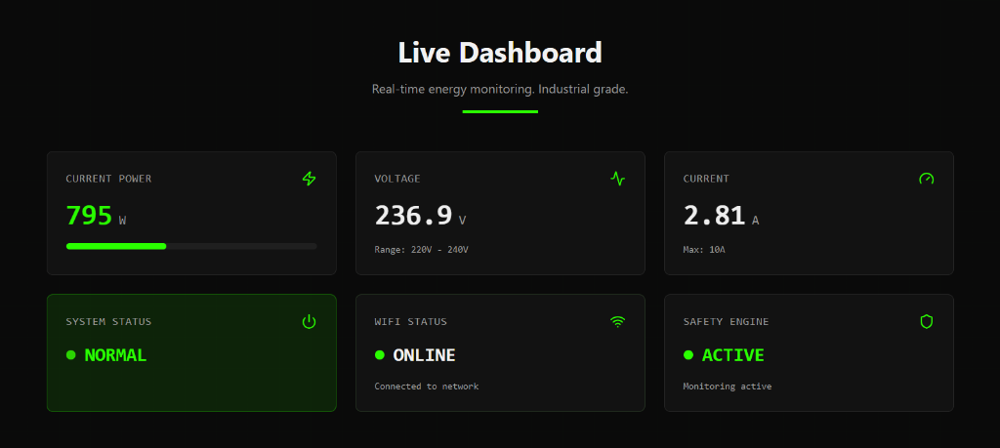
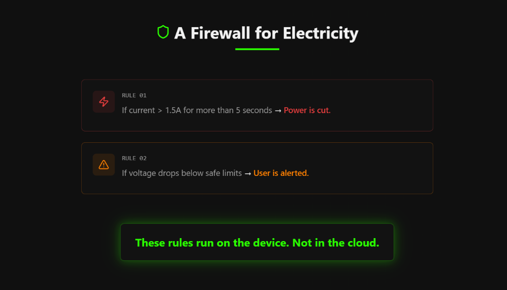
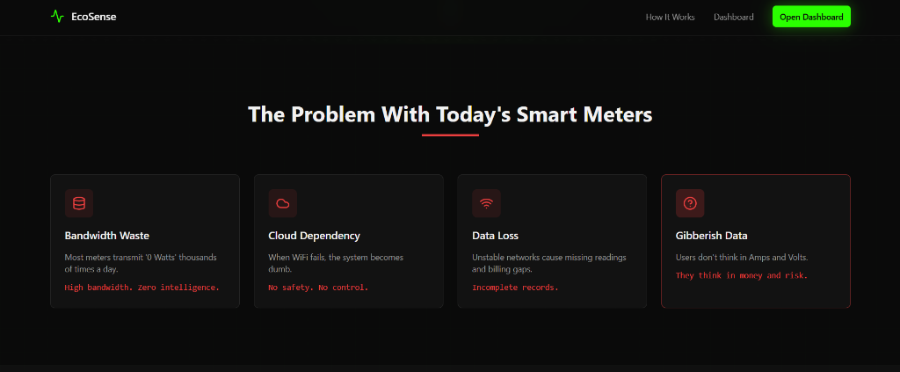

# EcoSense - Smart Home Energy Monitor



EcoSense is a modern, responsive, and real-time dashboard designed to monitor and manage smart home energy consumption. Built with **React**, **TypeScript**, and **Vite**, it offers a premium user interface for visualizing electrical parameters like Voltage, Current, and Power, along with cost estimation and safety alerts.

## 🚀 Features

### Real-Time Dashboard
Live gauges for Voltage (V), Current (A), and Power (W) with instant visual feedback.


### Intelligent Monitoring
-   **Cost Estimation**: Intelligent cost estimator card to track estimated electricity bills.
-   **Safety Alerts**: Visual indicators for system safety status.
-   **Bandwidth Saver Mode**: specialized mode to reduce data usage.



### Why EcoSense?
We address common issues with traditional smart meters: bandwidth waste, cloud dependency, and lack of actionable data.


### Tech Highlights
-   **Modern UI/UX**: Sleek Dark Mode, glassmorphism effects, and smooth animations using **Framer Motion** and **Tailwind CSS**.
-   **Responsive Design**: Fully responsive layout built with **Shadcn UI** components.

## 🛠️ Tech Stack

-   **Framework**: [React](https://react.dev/) + [Vite](https://vitejs.dev/)
-   **Language**: [TypeScript](https://www.typescriptlang.org/)
-   **Styling**: [Tailwind CSS](https://tailwindcss.com/)
-   **UI Components**: [shadcn/ui](https://ui.shadcn.com/)
-   **Icons**: [Lucide React](https://lucide.dev/)
-   **Charts**: [Recharts](https://recharts.org/)
-   **State Management**: [TanStack Query](https://tanstack.com/query/latest)
-   **Routing**: [React Router](https://reactrouter.com/)
-   **Form Handling**: [React Hook Form](https://react-hook-form.com/) + [Zod](https://zod.dev/)

## ⚡ Installation & Setup

Follow these steps to get the project running locally:

### Prerequisites

Ensure you have [Node.js](https://nodejs.org/) (v18 or higher) installed.

### Steps

1.  **Clone the Repository**
    ```bash
    git clone https://github.com/Thenithranjan/srmist-.git
    cd ecosense-dashboard-84
    ```

2.  **Install Dependencies**
    ```bash
    npm install
    ```

3.  **Run Development Server**
    ```bash
    npm run dev
    ```
    The app should now be running at `http://localhost:8080/`.

4.  **Build for Production**
    ```bash
    npm run build
    ```

## 📂 Project Structure

```
EcoSense/
├── src/
│   ├── components/      # Reusable UI components (shadcn, custom)
│   ├── hooks/           # Custom React hooks
│   ├── lib/             # Utility functions
│   ├── pages/           # Application pages (Dashboard, etc.)
│   ├── App.tsx          # Main application component
│   └── main.tsx         # Entry point
├── public/              # Static assets and screenshots
├── index.html           # HTML entry point
├── package.json         # Dependencies and scripts
├── tailwind.config.ts   # Tailwind configuration
└── vite.config.ts       # Vite configuration
```

## 🤝 Contributing

Contributions are welcome! Please follow these steps:

1.  Fork the repository.
2.  Create a new branch (`git checkout -b feature/YourFeature`).
3.  Commit your changes (`git commit -m 'Add some feature'`).
4.  Push to the branch (`git push origin feature/YourFeature`).
5.  Open a Pull Request.

## 📄 License

This project is licensed under the MIT License.

---

**EcoSense** — Empowering you to monitor your energy, one watt at a time.
